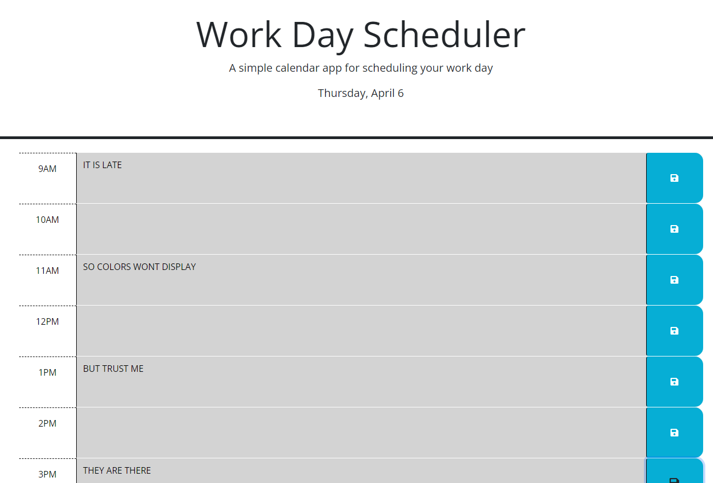

# Work Day Scheduler

## Description

This is a simple application for creating a twelve hour schedule inbetween the hours of 9am and 9pm. It provides the current day at the top of the page and gives visual clues as to what time of day it is.

## Usage

Typing your hourly schedule into the boxes allows you to keep track of your work day. Depending on the time of day the boxes change colors!

Grey: Hour and events passed.
Red: Current hour and events.
Green: Future events and hours.

Clicking the blue save button to the right of the box saves your input, allowing you to come back and see your schedule even if you closed the page!

Check it out [here](https://chemicalmodel.github.io/Daily-Calendar/)!

## Credits

Once again, thank you to the UCF Coding Bootcamp Instructor and TAs. As well as to my fellow students, the study group discord and ChatGPT!